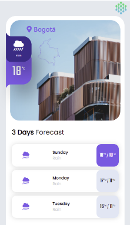

# GradiWeather

GradiWeather is a web app for getting real time weather information using OpenWeather API. Temperature is shown in Celsius and wind speed in km/h.

##### Table of Contents

-[Components](#components)  
-[API](#api)  
-[Responsive](#responsive)  
-[Future implementations](#future-implementations)  

## Components

You can find the following components in the web app:

### Main City

Shows the name of the city, map of the coountry, current weather and its corresponding icon, and current temperature in celius.

### 3 Days Forecast

Displays three cards showing the forecast weather of the next three following days, you can find the day of the week, weather condition and its icon, and maximum and minimum temperature

### Place to Visit

Consist of information about places you might like to visit, it's photo and name.

### City cards

Here you can display information of the current weather in any city. The elements are city, country, temperature, weather condition, humidity, wind speed and wind direction.

## APi

All the information that is display in the app is being fetch in real time from the following endpoint in the OpenWeather API.

### Current Weather Data

This endpoint gives you access to the current weather information from a city of choice. From the data provided, the app uses the name of the city, country, current temperature,weather condition, humidity, wind speed and wind direction. 

### One Call API

With this endpoint you can get information of the current weather and historical data aswell. This uses this data to provide the daily forecast of the next three following days.

## Responsive

This web app it's also devolped to work in mobile devices  

## Future implementations

- Ability to change the cards of city displayed.  
- Change the main city.  
- Dinamic cards at Place to Visit.  
- Show more info when selecting a card.
